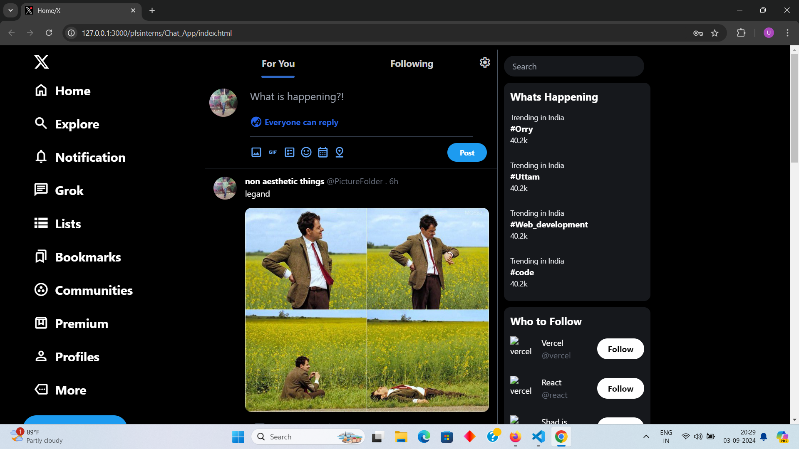

# Chat_App

# X.com Clone Using Tailwind CSS

This project is a clone of X.com, built using Tailwind CSS with added responsiveness for different devices. <br>
The project showcases a responsive and visually appealing layout using utility-first CSS provided by Tailwind. <br>

## Features

- **Responsive Design**: Optimized for mobile, tablet, and desktop devices.
- **Tailwind CSS**: Utilizes utility classes to create a clean and modern layout.
- **Custom Components**: Custom-made UI components styled with Tailwind CSS.
- **Cross-browser Compatibility**: Tested on major browsers for consistent look and feel.
- **Performance Optimization**: Minimized CSS for faster load times.

## Getting Started

Follow these instructions to set up the project on your local machine.

    npm install

    npm install -D tailwindcss postcss autoprefixer
    npx tailwindcss init -p

   Run in Local System

    npm run build


### Prerequisites

- Node.js (version 12 or higher)
- npm (version 6 or higher)

### Installation

1. **Clone the Repository:**
 
    ```git clone https://github.com/Uttamkumargupta000/pfsinterns.git```


## Screenshots

   
   <br> <br>


## Link for The Project 

[Chat_App](https://github.com/Uttamkumargupta000/pfsinterns/tree/main/Chat_App)