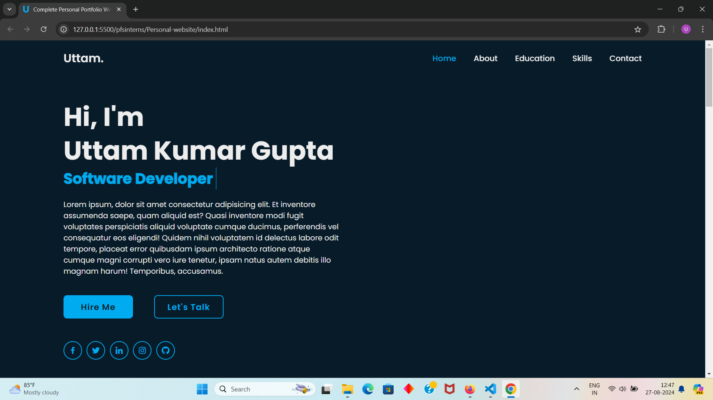
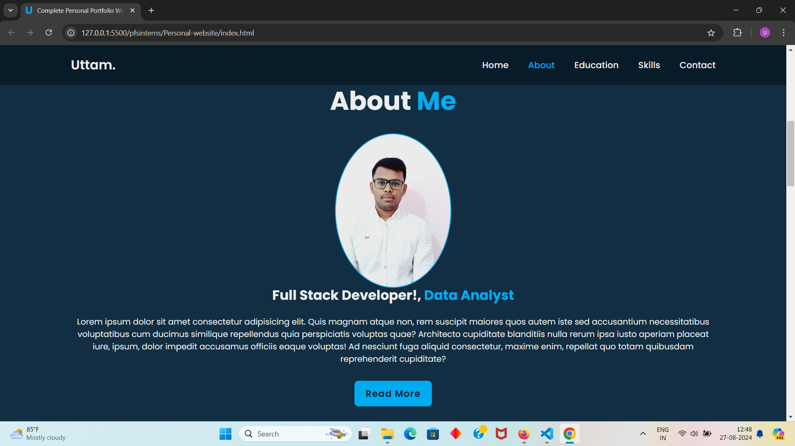

## About the Project

This project is a personal portfolio website designed and developed using HTML, CSS, and JavaScript.  
The portfolio showcases various sections, such as an About me, skills, projects, and contact information 
all presented in a visually appealing and user-friendly manner.  
The website features added animations and responsiveness to enhance the user experience.

### Key Features

- **Responsive Design**: The website is fully responsive, ensuring that it looks great on both desktop and mobile devices.
- **Smooth Animations**: Subtle animations have been added to various elements to provide a smooth and engaging user experience.
- **Organized Sections**: Clear and organized sections for easy navigation, making it easy for visitors to explore and learn more about you.
- **Demo Images**: Demo images are included using the `` tag to showcase different projects and aspects of the portfolio.

### Screenshots

Below are some screenshots demonstrating the look and feel of the portfolio:

### Full Code

You can find the full source code of the project [here](https://github.com/Uttamkumargupta000/pfsinterns/tree/main/Personal-website).
