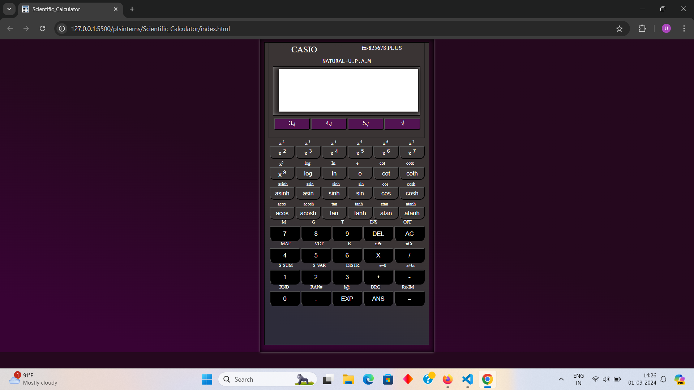
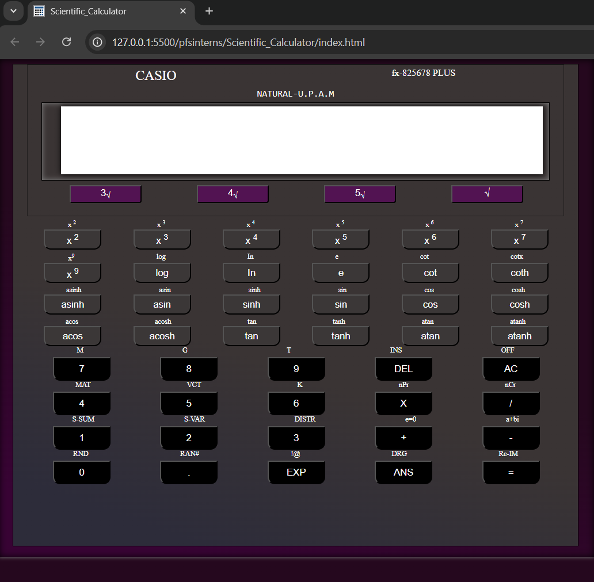

# Scientific_Calculator

## Scientific Calculator Project

This project is a scientific calculator application built using HTML, CSS, and JavaScript. It provides both basic and advanced mathematical operations, suitable for everyday calculations as well as more complex scientific computations. The design is responsive, ensuring the calculator is usable on devices with different screen sizes.
Features

   Basic Operations: Addition, subtraction, multiplication, and division.  
   Scientific Operations: Functions like square root, power, trigonometric calculations (sin, cos, tan), logarithmic functions, and more. 
   Responsive Design: Adapts to various screen sizes (desktop, tablet, mobile) for an optimal user experience. 
   User-Friendly Interface: A clean and intuitive interface for ease of use.  
   Styling with CSS: Modern and appealing design using CSS, with responsiveness achieved through media queries.  
   Keyboard Support: Use the keyboard for input in addition to clicking the buttons. 

Technologies Used

   HTML5: For the structure of the calculator interface.
   CSS3: For styling, including responsive adjustments with media queries.
   JavaScript: To handle the calculator's logic and functionality, including handling scientific functions.

Screenshots

   Desktop View:    
   
      
    Tablet View:     
       
   

   # Project

   [Visit Scientific_Calculator](https://github.com/Uttamkumargupta000/pfsinterns/tree/main/Scientific_Calculator)